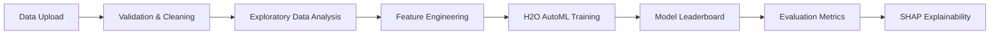

# Automated ML Analysis Platform

## 📌 Overview
This project is a **Streamlit-based ML platform** that makes machine learning accessible to **non-technical users**.  
It automates **exploratory data analysis (EDA), feature engineering, model selection, training, and interpretability** — all from a simple web interface.

The platform was developed as the **Final Project** for INFO 6105: *Data Science Engineering Methods* at Northeastern University.  
[📄 Project Report (PDF)](./Data%20Exploration%20and%20Machine%20Learning%20Modeling.pdf)

---

## 🚀 Features
- **Automated EDA**: Summary statistics, null checks, correlation heatmaps.
- **Data Cleaning & Validation**: Handles missing values and outliers.
- **Feature Engineering**: Encoding, scaling, and preprocessing pipelines.
- **H2O AutoML Integration**: Train multiple models automatically and compare performance.
- **Leaderboard**: Ranking of models by accuracy, AUC, etc.
- **Interpretability with SHAP**: Global and local explanations of predictions.
- **Interactive Visualizations**: Plotly-powered graphs for datasets and models.

---

## 🏗️ Architecture


---

## ⚙️ Tech Stack
- **Frontend/UI**: [Streamlit](https://streamlit.io/)  
- **Data Processing**: Pandas, Scikit-learn  
- **Machine Learning**: H2O AutoML  
- **Interpretability**: SHAP  
- **Visualization**: Plotly  

---

## 📊 Results
- **30% reduction** in analysis time compared to manual workflows  
- **100+ datasets** processed automatically  
- **50+ trained models** with explainability reports generated  
- **20+ non-technical users** successfully onboarded  

---

## 📂 Repository Structure
```
Streamlit Project/
│── app.py                     # Main Streamlit app
│── utils/                     # Helper functions
│── notebooks/                 # Prototyping & EDA
│── Data Exploration and Machine Learning Modeling.pdf  # Final Report
│── requirements.txt            # Dependencies
```

---

## ▶️ How to Run
```bash
# Clone repo
git clone https://github.com/dharun-karthick-ramaraj/INFO6105-DSEM.git
cd "Final Project/Streamlit Project"

# Install dependencies
pip install -r requirements.txt

# Run Streamlit app
streamlit run app.py
```

---

## 📝 Lessons Learned
- UI simplicity encourages adoption by non-technical users.  
- Explainability (via SHAP) builds trust in model predictions.  
- Automated ML is powerful, but must include strong **data validation**.  
- Streamlit is excellent for **rapid ML prototyping**.  

---

## 👨‍💻 Author
Dharun Karthick Ramaraj  
[Portfolio](https://portfolio.zezekay.com) | [LinkedIn](https://www.linkedin.com/in/dharun-karthick-ramaraj)
